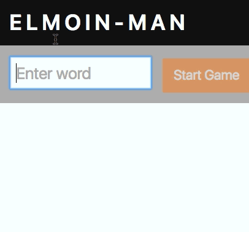

# ELMOIN-MAN Exercise (Elmoin Meetup October 2016)



The `ELMOIN-MAN` game based on the game [`Starman`](https://github.com/wimvanderbauwhede/HaskellMOOC/blob/master/Starman/starman.hs) written in Haskell  by [Wim Vanderbauwhede](https://github.com/wimvanderbauwhede).

## Exercise

1 Fork repo https://github.com/elmoin/starman-exercise.git

2 Install dependencies and run app

```
npm i
npm start
```

3 Open [http://localhost:3333](http://localhost:3333) in your browser.

4 Open `App.elm` to finish the game and have fun :)

5 Feel free to open pull a request to show you result ;)


### Tips

- Use methods of [`String` package](http://package.elm-lang.org/packages/elm-lang/core/4.0.5/String) to compare and display Strings.

- Last of all: There is already a solution of this exercise: [branch `solution`](../tree/solution)


## License

[MIT](./LICENSE)


_Moin Moin Elmoin && have fun :)_
